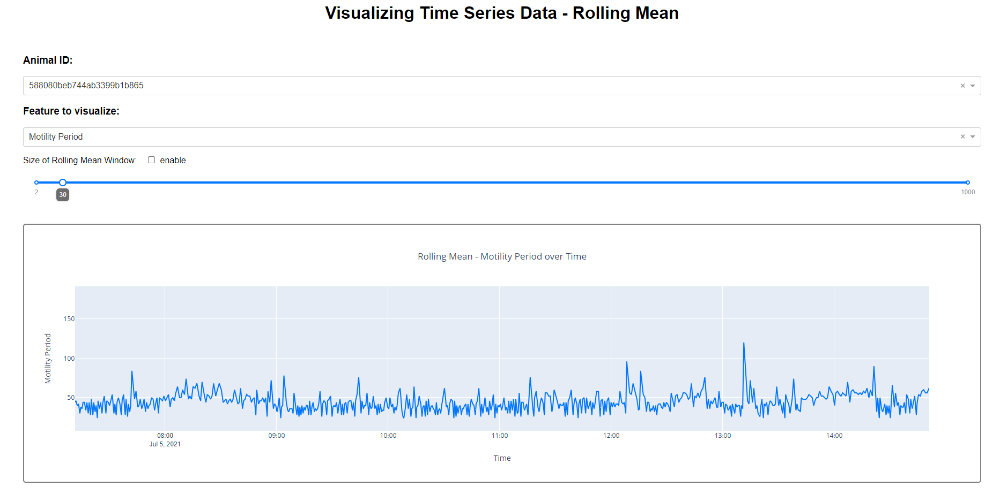
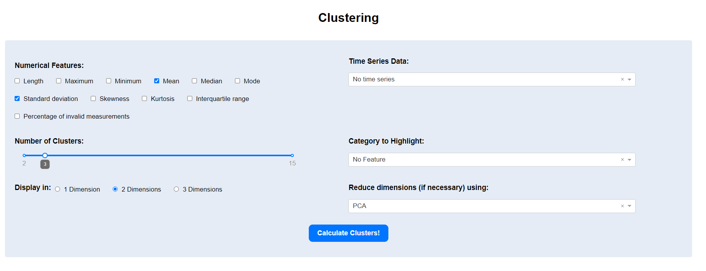

# Clustering of Time Series data

### Master Project with smaXtec

&nbsp;

##### Supervisor: Prof. Pernkopf Franz

##### Student: Leopold Leonhard

&nbsp;

## Features

- Derives numerical features like the length, minimum, maximum, IQR, number of invalid recordings, etc. from each
  recording
- Visualizes these derived numerical features as histograms or heatmaps in the dashboard
- Visualizes categorical features (Time zone, Group, etc.) of the data as bar charts in the dashboard
- Visualizes time series data over time (mot\_period, mot\_pulse_width, etc.)
- Calculates the rolling mean of the time series data with adjustable window size and visualizes it.
- Allows to choose any number of numerical features or time series data as input to cluster the data. The result is
  evaluated using different measures and can be reduced in dimensionality using PCA to display the clusters in 1, 2 or 3
  dimensions. Additionally, categories (like Timezone, Group, etc.) can be highlighted in the graph and evaluation
  scores are calculated to compare the selected category to clusters.
- All possible combinations of features can be iterated automatically to find the best possible clusters based on
  aforementioned evaluation scores.

## util.py

This file contains utility functions. This file is not required to be executed to use the dashboard. However, steps 4
and 5 can currently only be accessed from the command line.

1. __Parse data__: Originally, the data was in 268 Parquet files that contained the data of multiple animals each. There
   was also the issue that some data was split amongst multiple files. Loading all 268 into memory and combining them
   into a dataframe which is constantly filtered, takes a lot of resources. Therefore, the data was reformatted, unused
   columns dropped and parsed into a single file for every animal in the \'parsed_data\' folder. If the original data is
   used, save it into the 'original_data' folder and execute this step. (After this step, time series data can be
   visualized in the dashboard.)
2. __Calculate features__: In order to cluster data and visualize numerical features of the time series data, these
   features need to be calculated first. This includes features like length, mean, IQR, etc. The file
   \'parsed_data/metadata.pkl\' is created and for every individual animal these features are saved to easily and
   quickly use them later (After this step, numerical features can be visualized in the dashboard and can also be used
   for clustering.)
3. __Preprocessing time series data__: To use time series data for clustering, some preprocessing steps need to be done.
   It is important that every time series is of the same length and does not contain empty values since every single
   timestamp represents an input dimension for the clustering algorithm. Thus, every time series was padded to the same
   length and missing values where interpolated. Here, it is also possible to calculate the rolling mean. It is strongly
   advised to use the PCA option to reduce the dimensionality of the data due to the size of the data which needs to be
   in memory at the same time during clustering (PCA down to 10 dimensions results in a total file size of only 315 KB
   for ALL animals in the dataset). The preprocessed files saved into the 'preprocessed_data' folder. The metadata (Used
   data, rolling mean window, PCA dimension) is preserved in the filename. (After this step, the preprocessed time
   series data can be selected in the clustering tab in the dashboard)
4. __Find the best clusters__: This step is not needed for the dashboard. A list of all possible combinations of input
   features for the clustering algorithm is iterated to find the best clusters. This list contains a selection of
   multiple numerical features, which was chosen after looking at their histograms. This list also combines all
   combinations of numerical features with a single file of preprocessed time series data. All these combinations are
   tested with a range of different numbers of clusters. The clusters are evaluated using the silhouette score and for
   every category with the adjusted mutual information score & adjusted rand score. These results are saved to the '
   kmeans_evaluation.json' file. (Note: At first, iterating through all combinations of features seems resource
   intensive, but in reality, it is rather quick. Any combination 5 numerical features combined with 1 of 4 preprocessed
   time series were clustered into 3 to 6 clusters which results in 620 combination that were evaluated. This only takes
   around 1-2 minutes)
5. __Displaying the best clusters__: This step is not needed for the dashboard. The fourth step resulted in a file that
   saved the evaluation score for every combination of features. This step simply looks through the list to find the
   best clusters according to each evaluation score.

## dashbaord.py

To avoid creating a program that you have to exclusively interact with via a command line and that outputs a large
number of different plots, a dashboard was created that allow the visualization of any chosen different features and
different clusters. The dashboard is divided into 5 Tabs. (At least the first two steps of the util.py setup need to be
done to use the dashboard. Step 3 needs to be done if time series data is needed while clustering.)

- __Histogram/Heatmap__: Here, the numerical features calculated in step 2 of util.py can be visualized. The bin size of
  the histogram is adjustable in the dashboard. This can be used to see which features might be useful for clustering.

  

  When two features are selected, two histograms and a combined heatmap of the selected features are created.

  
- __Barchart__: In this tab, the number of occurrences of categorical features can be visualized in a bar chart. This
  includes the timezone, the animal group and organisation.

  
- __Time series data over time__: The time series data parsed from the original files in setup step 1 can be visualized
  over time. Currently, this includes the Motility Period, the Motility Pulse Width and the Rumination Classification.

  
- __Rolling mean of the time series data over time__: Since, the rolling mean of any time series data can be calculated
  and used to cluster, this tab allows to have a look at it first and experiment with the window size.

  
- __Clustering__: Lastly, but most importantly is the clustering tab. The previous tabs are just visualizations of data
  to better decide what to use when clustering. Here, you have the options to select any numerical feature and every
  preprocessed time series data file from step 3 of the setup. If step 3 was not done, the clustering can still be done
  without this data. The number of wanted clusters can be adjusted and experimented with.

  
  Additionally, the resulting clusters are visualized. The number of dimensions the clusters are displayed in can be
  chosen and range from 1 to 3. Any categorical feature can be selected to be highlighted in this graph through
  different markers. Evaluation scores of the clusters are calculated and displayed. All of this can be used to test
  different approaches to find clusters that may represent abnormalities or that coincide with any categorical feature.

  

# Usage

## Setup

When the original data is used, place it into the 'original_data' folder and execute steps 1 - 3 in the setup tab on the
dashboard. 

```
python dashboard.py
```

Simply start the dashboard.py script to open the dashboard in the localhost. Usually, http://127.0.0.1:8050/ can be
opened, after the script was started, to access the dashboard.

# Possible Additions & Current Issues

- Functionality:
    - Currently, K-Means is used for clustering. Other clustering algorithms could be added.
    - In the preprocessed data, numerical features of only the Motility Period are calculated. Numerical features of the
      Motility Pulse Width or Rumination Classification could also be valuable.
    - Currently, only a single file containing preprocessed time series data at a time can be chosen when clustering.
      Potentially, better clusters can be archived when combining time series data while clustering.
- Usability:
    - Currently, pickle files are used to speed up loading and saving data. Other formats like parquet can be tested to
      save disk space or improve performance.
    - Adding indicators for the current position of a slider to the dashboard.
- Possible other approaches
    - Don't apply PCA before clustering, but rather just use a subset of the data and all dimensions.
    - Calculate and utilize not just the rolling mean, but rolling sum, std, nan count etc.
    - Currently, linear interpolation is used for missing values. Other methods could improve performance.

There are comments in the code that further explain approaches and design choices made in this project.
